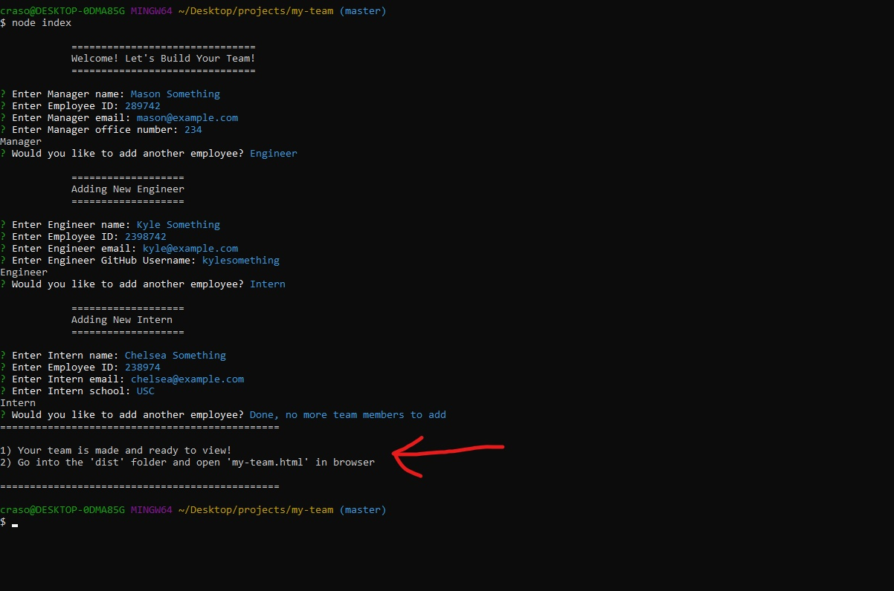

# My Team 

## Links

Repository Link: https://github.com/masonmarinko/my-team

Live URL Link: https://masonmarinko.github.io/my-team

## Description

Using the command prompt the user will answer a series of questions about employees. These questions, once all answered will output their "team" in the form of an HTML file/website. File will be in dist folder.

## Table of Contents
* [Installation](#installation)
* [Usage](#usage)
* [License](#license)
* [Questions](#questions)

## Video Demo

## Installation

1. Download repository

2. Once downloaded open command prompt and add the "inquirer" through npm by typing "npm install inquirer".

3. Once completed and ready to start ensure you are in the "my-team" folder.

4. You can then type "node index' in command prompt to start your team builder.

## Usage (After Installation)

1) Make sure that you are currently in the correct file location before starting.

2) Start program by typing "node index", you will then be greated with a series of questions.

3) The console log dynamically is shown to not only seperate previous date, but allow you to see what each section is for by dynamically changing. The first time through the questions it welcomes the user. After that it will then state which position/job you are creating.

4) After completing the first set of questions the user will then select between Engineer, Intern, or that they are done. Depending on the selection the app will either continue to ask job specific questions, or it will produce the HTML from the input.

5) Once completed the user is told that the html is created and where to find it.

6) Then the user is met with their web page based on answers (Actual results will vary based on user input and amount of employees).

## License

This project is covered under the following license(s): MIT

GitHub Profile: [masonmarinko](https://github.com/masonmarinko)

Questions? <Mason.P.Marinko@gmail.com>
